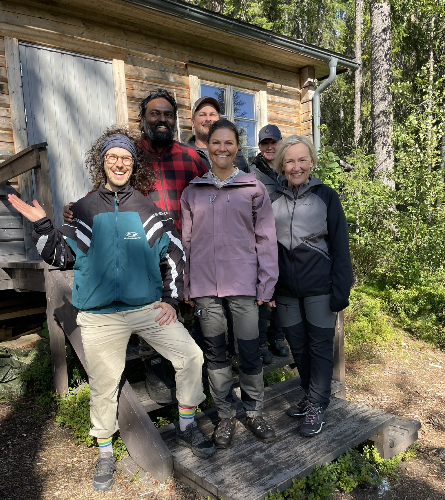

::: article
::: paragraph
::: text

&nbsp;

I usually take one long vacation every year, leaving plenty of time for festivals, seminars, friends — and, of course, nature.

&nbsp;

This summer, I spontaneously decided to go on a survival trip in the Swedish Björnlandets (“Bear Land”), expecting freezing temperatures and the sheer vastness of the wilderness to give me some real offline time.

&nbsp;

After nearly a week of hiking, picking blueberries and occasionally talking to myself, I came across a fully equipped cabin. It had firewood, a bed, and the kind of orderliness you don’t expect in the middle of nowhere. I dried my things and collapsed onto the bed.

&nbsp;

The next morning, I was woken up by a park ranger – and a TV-Chef. They told me the Crown Princess was arriving soon for lunch. I asked if I needed to leave. They said no. Then I asked if I could join. They agreed and I helped prepare reindeer sandwiches and coffee.

&nbsp;

Eventually, my wilderness retreat turned surreal. Around 30 people – photographers, park rangers and body guards – arrived at the cabin. In the middle of them Her Majesty, Victoria, Crown Princess of Sweden.

&nbsp;

Once it became clear that the bewildered, unwashed assistant didn't speak any Swedish, people got curious. I ended up chatting with Victoria, taking a photo for my mom, and even giving a interview to a newspaper.

&nbsp;

Eventually, they gave me a ride back to Umeå, where I spent the rest of my vacation camping in the city forest. I had gone seeking solitude — and somehow found a story.

### ᕱ

&nbsp;

> *"What a day it was for Lukas Erlenbach, who received an unexpected visit from the Crown Princess on his camping expedition — and was also treated to a meal prepared by the Wild Chef."* — Folkbladet, Västerbotton

:::
::: image
{class="portrait"} \
:::
:::
:::