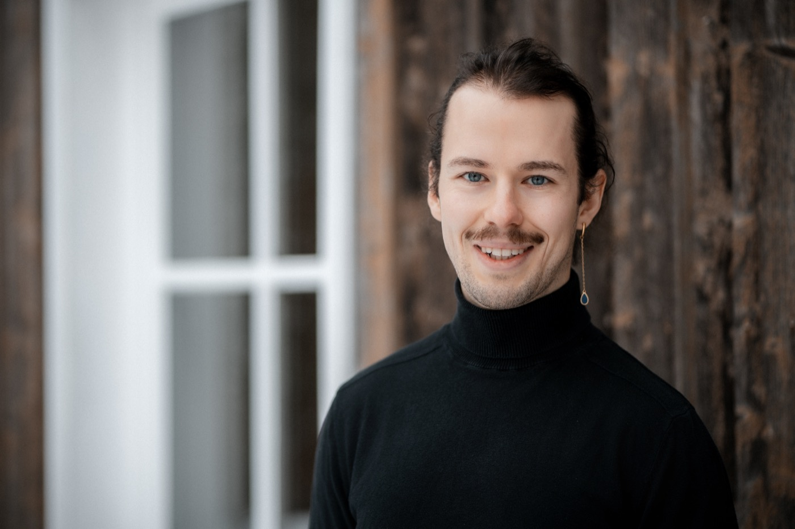

::: article
::: paragraph
::: text

&nbsp;

**Welcome.**

&nbsp;

I'm glad you're here.

&nbsp;

Perhaps this sounds familiar: The pressure to perform. Exhaustion. Restlessness. Endless loops of thought. Searching for intuition. Deep down, you know there could be more, but you can't seem to access it.

&nbsp;

Gestalt work is not about quick "fixes," but about honestly perceiving what is truly there. In the head, heart, belly, and pelvis. It is about better understanding your own needs and avoidance strategies.

&nbsp;

As a mathematician, ultrarunner, and management consultant, I know the balancing act between structure and flow. For me, Gestalt is the key to connecting control with trust and reclaiming aliveness.

&nbsp;

I am happy to accompany you if you desire change or feel overwhelmed by options. We work in a dialogue at eye level. Without pre-packaged advice. Together, we explore which patterns are standing in your way and how to access your resources again. At your pace, with humor, and mindful presence.

&nbsp;

*Currently, I am in advanced training as a Gestalt therapist at [Irgendwie Anders](https://irgendwie-anders.de/) and preparing for the state licensure as a Heilpraktiker für Psychotherapie.*

\

*My current offer is strictly limited to **Consulting, Coaching, and Self-Experience** for personal development. I do not offer diagnosis or medical treatment of mental disorders in a clinical sense at this stage.*

&nbsp;

Drop me a line to get to know me:
.

### 𖦹

&nbsp;

> *"Change occurs when one becomes what he is, not when he tries to become what he is not."*

> — Arnold R. Beisser

:::
::: image
{class="portrait"} \
:::
:::
:::